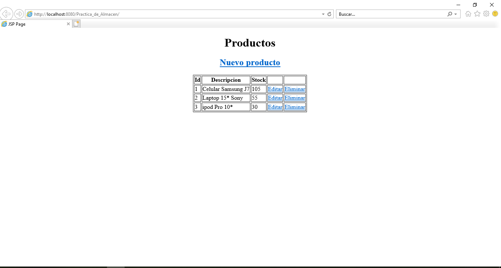
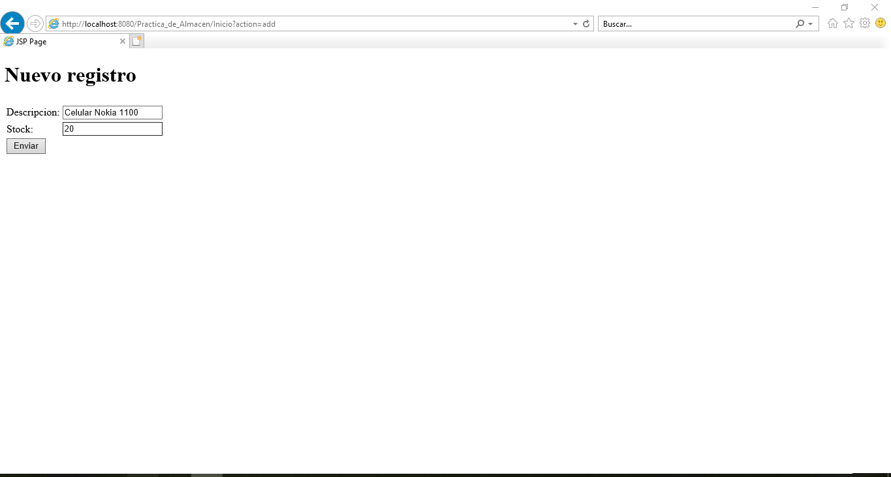
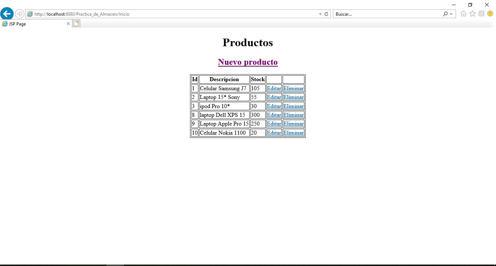
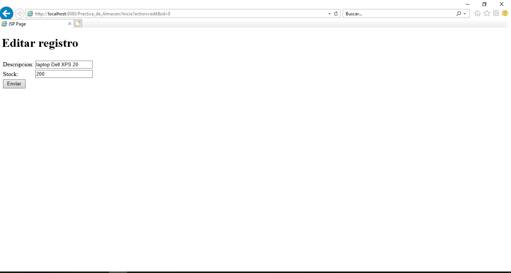
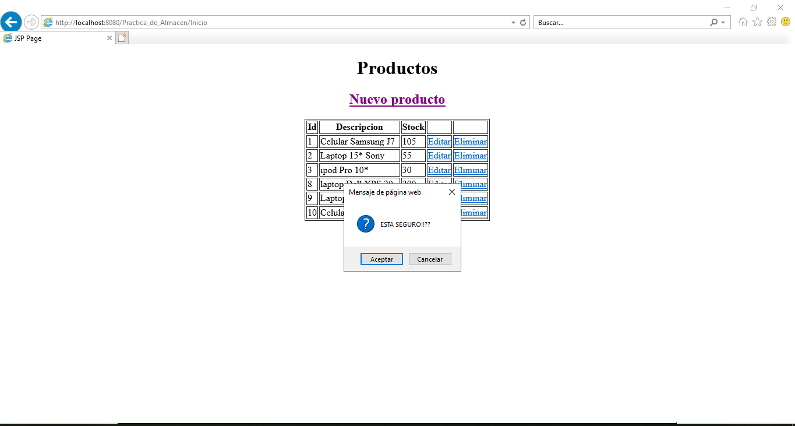
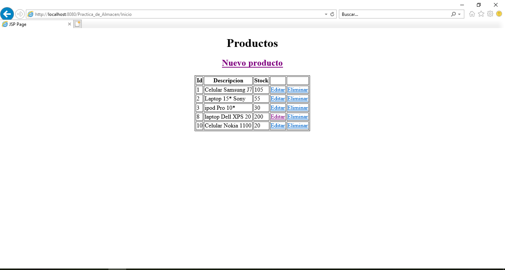

# PRACTICA NRO 5

# NOMBRE: ELBIS GONZALO MAMANI CASPA
# CI: 7048585 LP

# PATRÓN DE DISEÑO DAO

# Crear una aplicación Web para gestionar los productos de un almacén

# 1) Para esta tarea debe crear en MYSQL la base de datos bd_almacen y na tabla denominada productos (id: int, descripción: varchar(250), stock: int)
# 2) Insertar cinco registros de prueba
# 3) Crear las operaciones CRUD para la tabla correspondiente utilizando el patrón DAO

